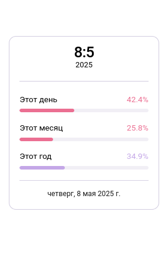

# Mastodon Time & Progress Panel

**Mastodon Time & Progress Panel** is a UserScript that adds a stylish and informative panel to the Mastodon interface. The panel displays the current date, as well as clear progress bars showing the elapsed portion of the current day, month, and year.

**[Русская версия README (Russian README)](README.ru.md)**

  
  
   <em>The panel adapts to Mastodon's dark and light themes</em>

## 🌟 Key Features

*   **Informative Panel:** Displays the current day and month, year, as well as the full date with the day of the week.
*   **Visual Progress:**
    *   Progress bar for the current day.
    *   Progress bar for the current month.
    *   Progress bar for the current year.
*   **Automatic Localization:** The panel language (labels "This Day", "This Month", "This Year", and the full date format) automatically adapts to your Mastodon interface language (Russian and English are supported).
*   **Customizable Colors:** Ability to change the accent colors for each of the progress bars via the script's settings menu.
*   **Theme Adaptation:** The panel's text elements inherit colors from your current Mastodon theme for better integration.
*   **Dynamic Updates:** Data on the panel updates every minute.
*   **Settings Persistence:** Chosen colors are saved between sessions.

## ⚙️ Installation

1.  **Install a UserScript Manager:** You'll need a browser extension such as:
    *   [Tampermonkey](https://www.tampermonkey.net/) (recommended)
    *   [Violentmonkey](https://violentmonkey.github.io/)
    *   [Greasemonkey](https://www.greasespot.net/) (for Firefox)
2.  **Install the Script:**
    *   Go to the [installation link](https://raw.githubusercontent.com/ZenonEl/mastodon-time-progress-panel/main/mastodon-time-progress-panel.user.js).
    *   Your UserScript manager should automatically prompt you to install the script. Click "Install".

## 🛠️ Configuration

After installing the script, you can customize the progress bar colors through your UserScript manager's command menu (e.g., by clicking the Tampermonkey icon in your browser's toolbar):

*   **Panel Settings: Enter custom RED accent color (hex):**
    Allows you to change the color of the progress bar for "This Day".
*   **Panel Settings: Enter custom GREEN accent color (hex):**
    Allows you to change the color of the progress bar for "This Month".
*   **Panel Settings: Enter custom PURPLE accent color (hex):**
    Allows you to change the color of the progress bar for "This Year".

Enter the desired color in hexadecimal format (e.g., `#FF0000` or `#F00`).

## ✅ Compatibility

The script has been tested and should work on most modern Mastodon instances.
The primary tested `@match` rules include:
*   `https://mastodon.ml/*`
*   `https://fosstodon.org/*`

Theoretically, it should work on any Mastodon instance that uses a standard DOM structure and CSS variables.

**Browsers:**
*   Chrome (with Tampermonkey/Violentmonkey)
*   Firefox (with Tampermonkey/Violentmonkey/Greasemonkey)
*   Edge (with Tampermonkey/Violentmonkey)
*   Opera (with Tampermonkey/Violentmonkey)
*   And other browsers that support WebExtensions and UserScript managers.

## Contact

If you have questions, suggestions, or find a bug, you can contact me:
*   Via Issues on [GitHub](https://github.com/ZenonEl/mastodon-time-progress-panel/issues)
*   On Mastodon: [@ZenonEl@mastodon.ml](https://mastodon.ml/@ZenonEl) or [@ZenonEl@fosstodon.org](https://fosstodon.org/@ZenonEl)

## License

This project is licensed under the [GPL-3.0-or-later](LICENSE) license.
You can find a copy of the license in the `LICENSE` file in this repository.

---

*Made with ❤️ by ZenonEl*
