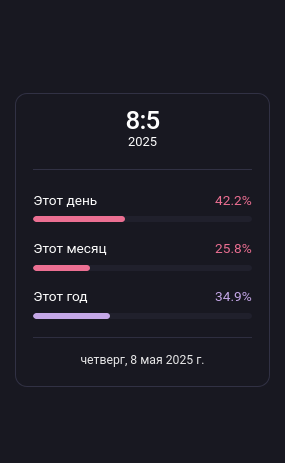
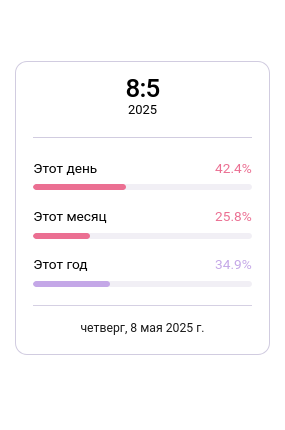

# Mastodon Time & Progress Panel

**Mastodon Time & Progress Panel** — это UserScript, который добавляет стильную и информативную панель в интерфейс Mastodon. Панель отображает текущую дату, а также наглядные прогресс-бары, показывающие прошедшую часть текущего дня, месяца и года.

  
  
   <em>Панель адаптируется к темной и светлой темам Mastodon</em>

## 🌟 Основные возможности

*   **Информативная панель:** Отображает текущее число и месяц, год, а также полную дату с днем недели.
*   **Визуальный прогресс:**
    *   Прогресс-бар для текущего дня.
    *   Прогресс-бар для текущего месяца.
    *   Прогресс-бар для текущего года.
*   **Автоматическая локализация:** Язык панели (метки "Этот день", "Этот месяц", "Этот год" и формат полной даты) автоматически адаптируется под язык интерфейса вашего Mastodon (поддерживаются русский и английский).
*   **Настраиваемые цвета:** Возможность изменить акцентные цвета для каждого из прогресс-баров через меню настроек скрипта.
*   **Адаптация к теме:** Текстовые элементы панели наследуют цвета от текущей темы вашего Mastodon для лучшей интеграции.
*   **Динамическое обновление:** Данные на панели обновляются каждую минуту.
*   **Сохранение настроек:** Выбранные цвета сохраняются между сессиями.

## ⚙️ Установка

1.  **Установите менеджер UserScripts:** Вам понадобится расширение для браузера, такое как:
    *   [Tampermonkey](https://www.tampermonkey.net/) (рекомендуется)
    *   [Violentmonkey](https://violentmonkey.github.io/)
    *   [Greasemonkey](https://www.greasespot.net/) (для Firefox)
2.  **Установите скрипт:**
    *   Перейдите по [ссылке на установку](https://raw.githubusercontent.com/ZenonEl/mastodon-time-progress-panel/main/mastodon-time-progress-panel.user.js).
    *   Менеджер UserScripts должен автоматически предложить установить скрипт. Нажмите "Установить".

## 🛠️ Настройка

После установки скрипта, вы можете настроить цвета прогресс-баров через меню команд вашего менеджера UserScripts (например, клик по иконке Tampermonkey на панели браузера):

*   **Настройки панели: Введите свой КРАСНЫЙ акцентный цвет (hex):**
    Позволяет изменить цвет прогресс-бара для "Этого дня".
*   **Настройки панели: Введите свой ЗЕЛЕНЫЙ акцентный цвет (hex):**
    Позволяет изменить цвет прогресс-бара для "Этого месяца".
*   **Настройки панели: Введите свой ФИОЛЕТОВЫЙ акцентный цвет (hex):**
    Позволяет изменить цвет прогресс-бара для "Этого года".

Введите желаемый цвет в шестнадцатеричном формате (например, `#FF0000` или `#F00`).

## ✅ Совместимость

Скрипт протестирован и должен работать на большинстве современных экземпляров Mastodon.
Основные проверенные `@match`-правила включают:
*   `https://mastodon.ml/*`
*   `https://fosstodon.org/*`

Теоретически, он должен работать на любом экземпляре Mastodon, где используется стандартная структура DOM и CSS-переменные.

**Браузеры:**
*   Chrome (с Tampermonkey/Violentmonkey)
*   Firefox (с Tampermonkey/Violentmonkey/Greasemonkey)
*   Edge (с Tampermonkey/Violentmonkey)
*   Opera (с Tampermonkey/Violentmonkey)
*   И другие браузеры, поддерживающие WebExtensions и менеджеры UserScripts.

## 📞 Связь

Если у вас есть вопросы, предложения или вы нашли ошибку, вы можете связаться со мной:
*   Через Issues на [GitHub](https://github.com/ZenonEl/mastodon-time-progress-panel/issues)
*   В Mastodon: [@ZenonEl@mastodon.ml](https://mastodon.ml/@ZenonEl) или [@ZenonEl@fosstodon.org](https://fosstodon.org/@ZenonEl)

## 📄 Лицензия

Этот проект лицензирован под лицензией [GPL-3.0-or-later](LICENSE).
Вы можете найти копию лицензии в файле `LICENSE` в этом репозитории.

---

*Создано с ❤️ ZenonEl*